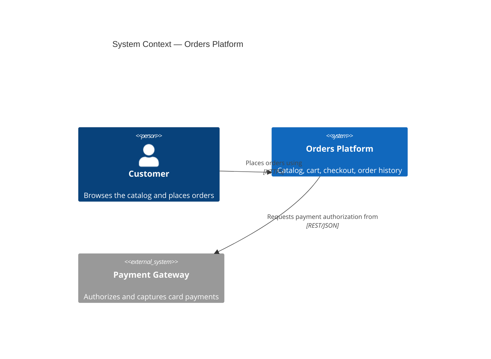
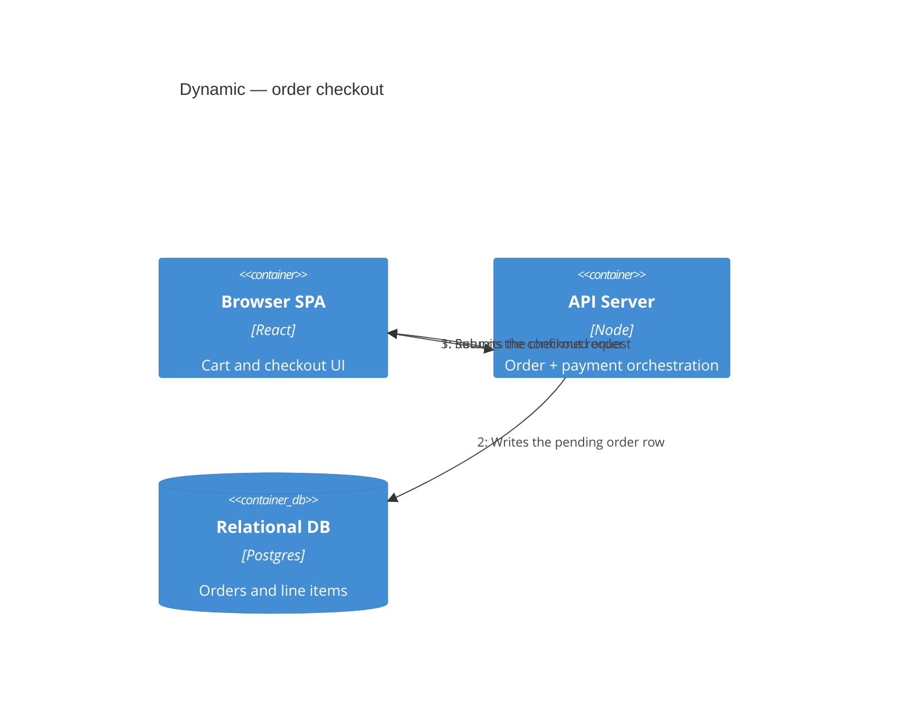

# Mermaid C4 Syntax Reference (+ renderer integration)

Target renderer: **Mermaid 11.x** (test against whatever version your project's Mermaid
viewer/renderer pins). Scope: authoring C4 diagrams as `.mmd` files that parse in 11.x and
render cleanly. Abstraction/level meaning is in `c4-levels.md`; notation rules in
`notation-and-review-checklist.md`.

> This is Mermaid's own **C4 dialect** (adapted from C4-PlantUML), **not** the C4 spec, and
> **not** documented on c4model.com. Mermaid marks C4 support **experimental** — the grammar
> is looser and less battle-tested than flowchart/ER; expect parser fragility on edge cases.

**Confidence markers below:** **CONFIRMED** = stable/verified in Mermaid's C4 grammar;
**UNVERIFIED** = not confirmed to exist/work in 11.x — treat as unsupported until tested.
Do not upgrade an UNVERIFIED marker to a fact without a live render check.

---

## 1. Syntax reference

### Declaration (first non-comment line)

One of: `C4Context` · `C4Container` · `C4Component` · `C4Dynamic` · `C4Deployment`.
An optional `title <text>` line follows. `%%` starts a comment line.

### Element macros — `alias` is an unquoted id; text args are quoted

| Macro | Signature | Type |
|---|---|---|
| `Person(alias, "label", "?descr")` | 2–3 args | internal person |
| `Person_Ext(alias, "label", "?descr")` | 2–3 | external person |
| `System(alias, "label", "?descr")` | 2–3 | internal system |
| `SystemDb(...)` / `SystemQueue(...)` | 2–3 | system (db / queue shape) |
| `System_Ext` / `SystemDb_Ext` / `SystemQueue_Ext(...)` | 2–3 | external system |
| `Container(alias, "label", "?techn", "?descr")` | 2–4 | container |
| `ContainerDb(...)` / `ContainerQueue(...)` | 2–4 | container (db / queue) |
| `Container_Ext` / `ContainerDb_Ext` / `ContainerQueue_Ext(...)` | 2–4 | external container |
| `Component(alias, "label", "?techn", "?descr")` | 2–4 | component |
| `ComponentDb` / `ComponentQueue` / `Component_Ext(...)` | 2–4 | component variants |

Deployment (`C4Deployment`): `Deployment_Node(alias, "label", "?type", "?descr")`; aliases
`Node`, `Node_L`, `Node_R` (left/right layout hint). Elements nest inside a node's `{ }`.

Optional keyword args (append after positional): `$tags="..."`, `$link="url"`,
`$descr="..."`, `$sprite="..."`. **`$link` CONFIRMED; `$sprite` / `$tags` are UNVERIFIED as
*rendered* — see §2.**

### Boundaries — brace block, nest elements inside (they nest)

```
Enterprise_Boundary(alias, "label") { ... }
System_Boundary(alias, "label") { ... }
Container_Boundary(alias, "label") { ... }
Boundary(alias, "label", "?type") { ... }        %% generic; ?type e.g. "network"
```

Alias is an unquoted id; label is quoted.

### Relationships

| Macro | Meaning |
|---|---|
| `Rel(from, to, "label", "?techn")` | directed edge (auto direction) — CONFIRMED |
| `BiRel(from, to, "label", "?techn")` | bidirectional — CONFIRMED |
| `Rel_Up`/`Rel_U`, `Rel_Down`/`Rel_D`, `Rel_Left`/`Rel_L`, `Rel_Right`/`Rel_R` | force edge direction |
| `Rel_Back(from, to, "label", "?techn")` | reverse-direction edge — **UNVERIFIED in 11.x** |
| `BiRel_U/D/L/R` | directional bidirectional — **UNVERIFIED, avoid** |

In **C4Dynamic**, each `Rel(...)` is **auto-numbered in source order** — that is the whole
point of the dynamic view. **Do not hand-number** the interactions; order your `Rel` lines.

### Layout & styling directives (all CONFIRMED unless noted)

- `UpdateLayoutConfig($c4ShapeInRow="4", $c4BoundaryInRow="2")` — shapes-per-row and
  boundaries-per-row. **String values, quoted.**
- `UpdateElementStyle(alias, $bgColor="#hex", $fontColor="#hex", $borderColor="#hex", $shadowing="true", $shape="...", $legendText="...")`
  — colours must be **hex/rgba** (see §2).
- `UpdateRelStyle(from, to, $textColor="#hex", $lineColor="#hex", $offsetX="10", $offsetY="20")`
  — offsets nudge the label; values are quoted strings.
- `UpdateBoundaryStyle(alias, $bgColor=..., $fontColor=..., $borderColor=...)`.
- `Lay_D / Lay_U / Lay_L / Lay_R`, `Lay_Distance` (C4-PlantUML positioning hints) —
  **UNVERIFIED in Mermaid**; layout is auto (dagre-style). Use `Rel_U/D/L/R` +
  `UpdateLayoutConfig` instead of `Lay_*`.

---

## 2. Known limitations & gotchas (Mermaid 11.x)

- **Experimental status.** Parser is looser than flowchart/ER; edge cases can break.
- **No manual layout.** Positions are auto-computed. Steer only coarsely via `Rel_U/D/L/R` and
  `UpdateLayoutConfig`. Large diagrams sprawl/overlap; you cannot pin a box. **#1 reason to
  fall back to a flowchart** for complex topologies (§3).
- **Label wrapping is manual.** No auto-wrap inside a box — insert `<br/>` yourself:
  `System(a, "Orders<br/>Platform", "...")`.
- **No auto legend.** Mermaid does **not** render a C4-PlantUML-style legend/key.
  `SHOW_LEGEND()` / `LAYOUT_WITH_LEGEND()` **do not exist here**. If a legend is required, draw
  it as extra elements or annotate in surrounding Markdown. (Notation rules still require a key.)
- **Quoting / comma / paren escaping.** Args are comma-separated inside `(...)`. A literal
  comma or parenthesis in an *unquoted* label breaks the parse. **Always double-quote any
  label/descr containing `,` `(` `)` `:`.** Even quoted, a literal `"` inside a label is
  unreliable — avoid nested double quotes; there is no robust escape, prefer rephrasing.
- **Colours must be hex/rgba, never OKLCH.** `UpdateElementStyle`/`UpdateRelStyle` colours go
  through the khroma color parser. An `oklch(...)` value blanks the render with
  `Unsupported color format`.
- **Sprite/tag gaps vs C4-PlantUML.** C4-PlantUML's `AddElementTag`/`AddRelTag`, tag-driven
  styling, and sprite icons (`$sprite=&aws-...`) are **UNVERIFIED / largely unsupported** in
  Mermaid. Keep diagrams **sprite-free**.
- **No `!include` / procedural macros.** Mermaid C4 is declarative only — C4-PlantUML
  `!include`, `!define`, `!procedure` and stdlib icon-set includes are **not available**.
- **Relationship technology text** renders as small edge text; long `techn` strings crowd the
  edge — keep them short.

---

## 3. Mermaid C4 vs plain flowchart-with-C4-conventions

**Use Mermaid C4 when:**
- Docs-in-repo, diffable `.mmd` next to code (GitHub/GitLab render Mermaid natively).
- Small/medium **Context** or **Container** diagrams — a handful of people/systems/containers.
- Quick "big issue" / architecture-sketch docs where semantic element types
  (person vs system vs db) and auto-styling save time.
- You want the C4 vocabulary explicit in source for future readers.

**Fall back to a plain `flowchart` with C4 styling conventions when:**
- Layout matters and auto-layout sprawls/overlaps (many boundaries, dense component views).
- You need precise grouping, ranking, or edge routing (`flowchart` gives `subgraph`,
  `direction`, and far more control).
- You need shapes/legends/tags Mermaid C4 lacks.
- The diagram must match an exact reviewer-approved layout.

### C4 semantics → plain-flowchart mapping (the common Structurizr/C4-PlantUML default palette, all hex — C4 itself dictates no colours, see notation-and-review-checklist.md §1)

| C4 element | Flowchart node | classDef |
|---|---|---|
| Person / Person_Ext | `id(["Name"])` stadium | `person: fill:#08427b,color:#fff` (ext `#686868`) |
| System (internal) | `id["Name"]` rect | `system: fill:#1168bd,color:#fff` |
| System_Ext | `id["Name"]` rect | `ext: fill:#999999,color:#fff` |
| Container | `id["Name<br/>[tech]"]` | `container: fill:#438dd5,color:#fff` |
| ContainerDb | `id[("Name")]` cylinder | `db: fill:#438dd5,color:#fff` |
| ContainerQueue | `id[/"Name"/]` parallelogram | `queue: fill:#438dd5,color:#fff` |
| Component | `id["Name<br/>[tech]"]` | `component: fill:#85bbf0,color:#000` |
| Boundary (any) | `subgraph b["Name"]` | dashed: `style b stroke-dasharray:5 5` |
| Rel | `A -->|"Uses<br/>[HTTPS]"| B` | label carries verb + tech |
| BiRel | `A <-->|"label"| B` | — |

Apply a class with `A:::person` and declare `classDef person fill:#08427b,color:#fff`. Keep
the C4 vocabulary in `%%` comments so intent survives without the macros. All colours hex
(the khroma/OKLCH rule still applies).

---

## 4. Renderer integration

Author the `.mmd`, then hand it **unchanged** to a Mermaid renderer — the project's own viewer
skill if it ships one, otherwise the `mmdc` CLI (`@mermaid-js/mermaid-cli`) or any host that
loads Mermaid 11.x and calls `mermaid.render`. Convention: output = same dir + same basename +
`.html`/`.svg` (`c4-l2-container.mmd` → `c4-l2-container.html`).

- **Does C4 render? YES (CONFIRMED).** C4 support shipped in Mermaid v10 and is present in
  11.x. Experimental = possible quirks on exotic syntax, not a hard block.
- **ER/flowchart-oriented viewer features no-op for C4.** A viewer that computes ER stats
  (entity/table counts, FK badges, entity search/indexing) will report zeros or "unknown" for a
  C4 file — its first token (`C4Context`/…) matches none of its ER/flowchart types. This is
  expected and harmless: the file is still valid, renders, and pan/zoom/download work.
- **Theming caveats.** Inject `themeVariables` as **hex/rgba** (never OKLCH). But Mermaid's C4
  renderer uses its **own** element colour scheme (blue people/systems) largely independent of
  `themeVariables` — a dark page background is fine but C4 boxes keep light-on-blue defaults, so
  **verify contrast visually.** An authored `UpdateElementStyle(..., $bgColor="oklch(...)")`
  blanks the render exactly like the config OKLCH bug — **enforce hex in authored C4 too.**
- **Recommendation:** run a one-time render check (see the `browser-verification` skill) on a
  real C4 fixture before trusting a new construct in a diagram.

---

## 5. Minimal validated snippets (confident parse in 11.x)





Both use only CONFIRMED constructs — quoted labels, `Rel`, `UpdateRelStyle` +
`UpdateLayoutConfig` with quoted `$` string args; no sprites, tags, `Lay_*`, `!include`,
or OKLCH.
