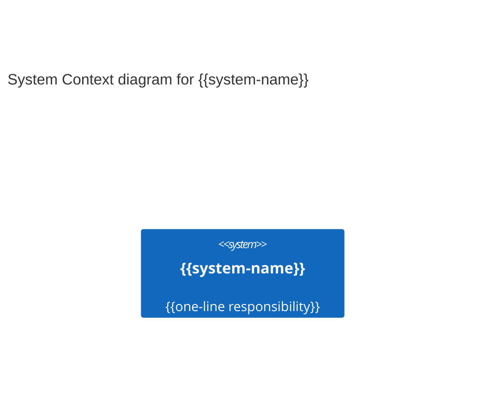

# Architecture — {{big-issue title}}

> Copy this file to the issue's task dir at
> `${AGENT_WORKSPACE_ROOT}/${AGENT_PROJECT}/workspace/working/{{YYYY}}/{{MM}}/{{DD}}/{{slug}}/reports/architecture.md`.
> Keep the whole narrative **≤ 200 lines** — the diagrams carry the detail, prose only frames
> them. Fill every `{{placeholder}}`; delete guidance blockquotes before you finish.

## 1. Problem & scope

{{The big issue in 2–3 sentences: what is broken / being added and why now.}}

- **In scope:** {{what this design covers}}
- **Out of scope:** {{explicitly excluded — name the adjacent work you are NOT doing}}

## 2. C4 levels used

> Pick the *minimum* levels that carry the argument. L1 + L2 for every big issue; add one L3
> per container this issue actually changes; skip L4 unless a load-bearing algorithm demands it.

| Level | Diagram | Included? | Why |
|---|---|---|---|
| L1 System Context | `c4-l1-context` | Yes | {{sets the frame}} |
| L2 Container | `c4-l2-container` | Yes | {{where this issue lives}} |
| L3 Component | `c4-l3-{{container}}` | {{Yes/No}} | {{only if this container changes}} |
| L4 Code | — | No | {{almost never — IDEs generate on demand}} |

## 3. System Context (L1)

> External actors + the systems around the system in scope. Detail is not important here; focus
> on people and software systems, not protocols. Source: `./c4-l1-context.mmd` → rendered
> `./c4-l1-context.html`. Inline copy for diffable review:

{{One paragraph naming each actor and external system and why it is on the diagram.}}

## 4. Containers touched

> The deployable units + their wires. One row per container this issue involves. Ground every
> box in the real inventory (`.claude/project.json` → `repos`/`apps`/`stack`, the project
> `CLAUDE.md`) — do **not** invent containers or protocols. The rows below are an *example* of
> the shape; replace them with your project's real containers.

| Container | Tech | Responsibility | Repo | Touched by this issue? |
|---|---|---|---|---|
| {{Browser SPA}} | {{React, TypeScript}} | {{customer web UI}} | {{repo-a}} | {{yes/no}} |
| {{API Server}} | {{Node}} | {{order + payment orchestration}} | {{repo-a}} | {{yes/no}} |
| {{Relational DB}} | {{Postgres + migrations}} | {{persistence}} | {{repo-a}} | {{yes/no}} |
| {{Identity Provider}} | {{OIDC}} | {{authn/authz}} | {{external}} | {{yes/no}} |

Diagram: `./c4-l2-container.mmd` → `./c4-l2-container.html`.

## 5. Component detail (L3) — include only if a container changes internally

> DELETE THIS SECTION unless the issue reshapes the internals of a container. One subsection
> per touched container; each links its own `./c4-l3-{{container}}.mmd`.

### 5.1 {{container-name}}

{{Components inside this container + their responsibilities. Diagram: `./c4-l3-{{container}}.mmd`.}}

## 6. Cross-tier contracts & data flows

- **Wire contract (source of truth):** {{the project's contract / interface doc, if it maintains
  one}}. Any change to an inter-container payload must update it in the same change.
- **Data layer:** {{note the query layer vs migration ownership, and any new/changed columns +
  migration id}}.
- **Key runtime flow:** `./c4-dynamic-{{flow}}.mmd` → `./c4-dynamic-{{flow}}.html` (optional
  C4Dynamic sequence; relations auto-number in source order — do not hand-number).

## 7. Decisions

> C4 captures *structure*; the *why* behind each boundary/technology choice belongs in an ADR.
> Author each from the ADR template (`.claude/templates/adr-template.md`, falling back to core's
> `templates/adr-template.md`): Context → Decision → Options Considered → Consequences →
> Migration Strategy; copy to `reports/adr-00N-{{slug}}.md`. Reference the ADR here — do not
> duplicate its options matrix inline.

| ADR | Decision (one line) | Status |
|---|---|---|
| [ADR-001](./adr-001-{{slug}}.md) | {{chose X over Y because …}} | {{accepted}} |

## 8. Risks & open questions

- **Do-not-touch overlaps:** {{list any of the project's safety-critical / do-not-touch paths
  this change reaches (the project's NEVER/ASK rules, if defined) and the required review/sign-off
  for each}}.
- **Open questions:** {{unresolved decisions that block or gate this work}}.
- **Risks:** {{what could go wrong; blast radius; mitigation}}.

## 9. Diagram index

| Level | Source `.mmd` | Rendered `.html` |
|---|---|---|
| L1 Context | `./c4-l1-context.mmd` | `./c4-l1-context.html` |
| L2 Container | `./c4-l2-container.mmd` | `./c4-l2-container.html` |
| L3 {{container}} | `./c4-l3-{{container}}.mmd` | `./c4-l3-{{container}}.html` |
| Dynamic {{flow}} | `./c4-dynamic-{{flow}}.mmd` | `./c4-dynamic-{{flow}}.html` |

---

<!-- PLACEMENT — do not delete -->
**Where this doc lives.** Default is **task-scoped**: it stays under the issue's task dir
`${AGENT_WORKSPACE_ROOT}/${AGENT_PROJECT}/workspace/working/{{YYYY}}/{{MM}}/{{DD}}/{{slug}}/reports/` alongside its `.mmd`/`.html`.
**Promote** a copy to the project's architecture docs directory by default (matching
`@architecture-designer`'s `{component}-design.md` output path; or another project docs area for a
topic-specific doc) **only** when the doc is durable, cross-team, and agreed — the task-dir version
stays as the work trail. A promotion that edits a cross-tier contract is an **ASK** (the project's
ASK policy). **Never** write loose `PLAN-*/AUDIT-*/architecture-*.md` at the workspace
root — `protect-sensitive-files.sh` blocks it (exit 2). Task card `README.md` at start and
`SUMMARY.md` at completion are mandatory.
